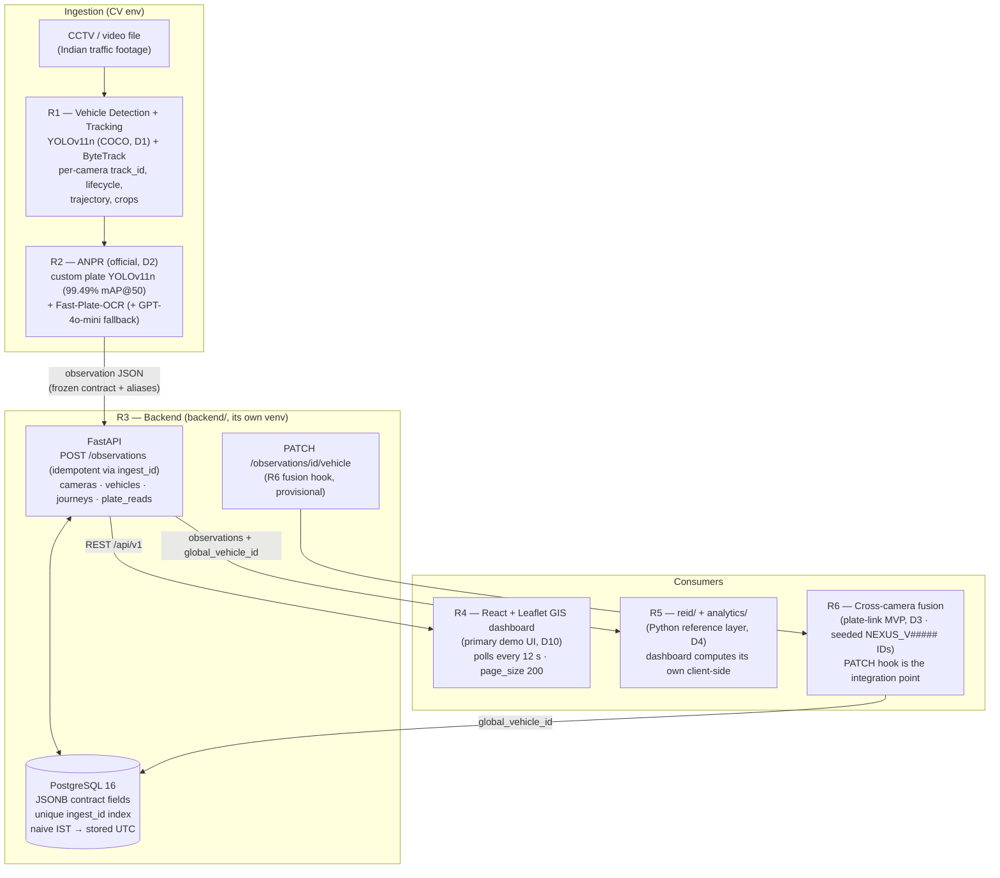

# NEXUS — System Architecture

Mermaid source of the architecture (GitHub renders it natively). The ASCII
version lives in the root README; this is the viva-friendly rendering.



## Data contract (frozen, all modules)

```
camera_id · frame_id · timestamp · track_id · vehicle_class
vehicle_bbox [x1,y1,x2,y2] · vehicle_crop · trajectory
plate_bbox · plate_text · plate_confidence
```

Confidence policy: API contract strictly [0,1]; rescaling from R2's 0–100
heuristic happens in exactly one place — the adapter
(`backend/app/integration/r1r2.py`), never in routes/schemas (decision C1).
Per-source confidences (plate detection vs OCR) are stored separately in the
`plate_reads` trail, never blended (C3).

## Identity model

| ID | Scope | Owner |
|---|---|---|
| `track_id` | per camera, always paired with `camera_id` | R1 |
| vehicle row | linked by plate at ingest (provisional vehicle per plate) | R3 |
| `global_vehicle_id` (`NEXUS_V#####`, canonical D6) | cross-camera global identity | R6 (plate-link MVP + seeded IDs for the demo) |

## Decision index

D1 COCO detector · D2 app.py engine = official R2 · D3 plate association +
seeded IDs (no fake Re-ID claims) · D4 client-side analytics · D6
`NEXUS_V#####` canonical · D8 CityFlowV2 = R6 validation dataset · D10
React dashboard = primary demo UI. Full texts: TODO.md.
